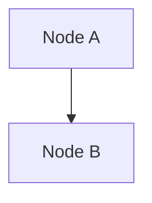

# Spark / PySpark Personal Book — Writing Skill

## What this skill is for

Writing the personal Spark/PySpark book at `C:\opt\learn\spark\notes\docs\spark-book\`.

Each chapter corresponds to one topic from the learning path (`docs/learning-path.md`). As the user masters a topic (via books, MOOCs, or hands-on work), they trigger this skill to write the chapter. The book is their synthesis — not notes from a single source, but their own explanation of the topic in their own words, verified against current Spark 4.x docs.

The book structure mirrors the learning path exactly:

```
Part 1 — Beginner     (Chapters 01–09)
Part 2 — Intermediate (Chapters 10–19)
Part 3 — Advanced     (Chapters 20–29)
Part 4 — Expert       (Chapters 30–38)
```

---

## Chapter Arc (full map)

Every chapter number maps to a learning-path topic code. Use this to determine chapter number, slug, and which learning-path section to cross-reference.

### Part 1 — Beginner

| Ch | Topic code | Title | Slug |
|---|---|---|---|
| 01 | B1 | Spark Architecture and the Execution Model | `spark-architecture` |
| 02 | B2 | SparkSession and Entry Points | `sparksession` |
| 03 | B3 | The DataFrame API: Basics | `dataframe-basics` |
| 04 | B4 | Reading and Writing Data | `reading-writing-data` |
| 05 | B5 | Schema: StructType, DDL, and Type Safety | `schema-type-safety` |
| 06 | B6 | Aggregations and GroupBy | `aggregations-groupby` |
| 07 | B7 | Joins: Types and Mechanics | `joins` |
| 08 | B8 | Spark SQL | `spark-sql` |
| 09 | B9 | Null Handling | `null-handling` |

### Part 2 — Intermediate

| Ch | Topic code | Title | Slug |
|---|---|---|---|
| 10 | I1 | Complex Types: Arrays, Maps, and Structs | `complex-types` |
| 11 | I2 | Window Functions | `window-functions` |
| 12 | I3 | User-Defined Functions: Python and pandas UDFs | `udfs` |
| 13 | I4 | RDD Fundamentals | `rdds` |
| 14 | I5 | Partitioning: Concepts and Control | `partitioning` |
| 15 | I6 | Caching and Persistence | `caching` |
| 16 | I7 | The Spark UI: Reading Plans and Diagnosing Jobs | `spark-ui` |
| 17 | I8 | Delta Lake Basics | `delta-lake-basics` |
| 18 | I9 | The Medallion Architecture | `medallion-architecture` |
| 19 | I10 | Data Formats: Parquet, Delta, Avro, JSON | `data-formats` |

### Part 3 — Advanced

| Ch | Topic code | Title | Slug |
|---|---|---|---|
| 20 | A1 | Query Optimisation: Catalyst and the Physical Plan | `catalyst-physical-plan` |
| 21 | A2 | Adaptive Query Execution | `aqe` |
| 22 | A3 | Join Strategies and Tuning | `join-strategies` |
| 23 | A4 | Data Skew and Shuffle Optimisation | `data-skew` |
| 24 | A5 | Advanced pandas UDFs and UDFs on Windows | `advanced-udfs` |
| 25 | A6 | Delta Lake Advanced: MERGE, SCD, Liquid Clustering | `delta-lake-advanced` |
| 26 | A7 | Structured Streaming: Fundamentals | `streaming-fundamentals` |
| 27 | A8 | Structured Streaming: Stateful Processing | `streaming-stateful` |
| 28 | A9 | ML Pipelines with Spark MLlib | `ml-pipelines` |
| 29 | A10 | Testing PySpark Pipelines | `testing-pipelines` |

### Part 4 — Expert

| Ch | Topic code | Title | Slug |
|---|---|---|---|
| 30 | E1 | Spark Internals: Memory, Execution, Serialisation | `spark-internals` |
| 31 | E2 | Production Deployment: Cluster Management and Scaling | `production-deployment` |
| 32 | E3 | Observability: Monitoring, Alerting, Logging | `observability` |
| 33 | E4 | Delta Lake Internals: Transaction Log and MVCC | `delta-internals` |
| 34 | E5 | Data Governance: Unity Catalog, Lineage, Security | `unity-catalog-governance` |
| 35 | E6 | Pipeline Orchestration with Dagster | `dagster-orchestration` |
| 36 | E7 | CI/CD for Data Engineering | `cicd-data-engineering` |
| 37 | E8 | Change Data Capture and Slowly Changing Dimensions | `cdc-scd` |
| 38 | E9 | Spark Connect and the Modern Client Architecture | `spark-connect` |

---

## File locations

| File | Purpose |
|---|---|
| `docs/spark-book/index.md` | Book progress table — one row per chapter |
| `docs/spark-book/ch<NN>-<slug>.md` | Chapter file (e.g. `ch11-window-functions.md`) |

Chapter numbers are always **two-digit zero-padded** (`ch01`, `ch11`, `ch38`).

---

## Workflow (follow in order every time)

### Step 1 — Identify the chapter

From the user's message, determine:
- Which learning-path topic code was completed (B1–B9, I1–I10, A1–A10, E1–E9)
- The chapter number and slug from the arc table above
- Whether the chapter file already exists (read it if so — this may be an update, not a new chapter)

### Step 2 — Research before writing

**Always web-search before writing.** Never rely solely on training data for API behaviour, version specifics, or best practices.

Run at least two searches:
```
"PySpark <topic> Spark 4.1 <year>"
"<topic> best practices PySpark 2025 2026"
```

Also check:
- `docs/research-cache/spark-api-versions.md` — API versions, function additions, config defaults
- `docs/research-cache/spark-source-internals-v412.md` — source-verified execution internals (QueryExecution, WholeStageCodegenExec, FileScanRDD, UnsafeRow, stage types)
- The relevant official docs page (see Code Standards below for URLs)

**Verifying against Spark v4.1.2 source:** Use the local checkout at `C:\opt\learn\spark\spark`. Read or grep files directly — do not rely on web search for source-level facts. Examples:

```powershell
# Find a config default
grep -r "maxFailures" "C:\opt\learn\spark\spark\core\src\main\scala\org\apache\spark\internal\config"

# Read a specific class
cat "C:\opt\learn\spark\spark\sql\core\src\main\scala\org\apache\spark\sql\execution\QueryExecution.scala"
```

Save any new verified facts to the appropriate cache file above.

### Step 3 — Write the chapter

Fit the chapter to the topic — there is no fixed section list. See **Chapter Form** below. File goes to `docs/spark-book/ch<NN>-<slug>.md`.

Rules:
- Write from first principles, in your own voice — not as a summary of a specific book
- Open by establishing why the topic matters, anchored in a concrete real-world scenario
- Every code block must be complete and runnable (all imports included)
- Build from minimal → complete — one new idea per example
- Where the chapter includes pitfalls, draw them from real bugs (book notes, web research, or verified behaviour) — never invented

### Step 4 — Sync site files

After writing the chapter, update all of these:

1. **`docs/spark-book/index.md`** — flip the chapter row from ⬜ to ✅, fill in the date
2. **`zensical.toml`** — add the chapter entry under the `"Spark Book"` nav group:
   ```toml
   { "Ch NN. Title" = "spark-book/ch<NN>-<slug>.md" }
   ```
3. **`docs/reference/glossary.md`** — append any new terms the chapter introduces (with source `Spark Book Ch NN`)
4. **`docs/topics/index.md`** — add any new cross-cutting topics to the backlog if they aren't already there

### Step 5 — Confirm to user

```
✓ Chapter NN: "<Title>" → docs/spark-book/ch<NN>-<slug>.md
  Learning-path topic: <code> (<level>)
  New glossary terms: N
  Next topic in learning path: <code> — <title>

Book progress: N / 38 chapters
```

---

## Chapter Form

**There is no fixed section template.** The right structure depends on the topic. A setup chapter, an API-family chapter, an architecture/internals chapter, and a tuning chapter each take a different shape — forcing them all through the same headings produces padded chapters where half the sections are filler. Fit the chapter to its topic.

### Fixed header (every chapter)

Start every chapter file with the title and metadata blockquote, then a one-paragraph hook:

```markdown
# Chapter NN — <Title>

> *Learning-path topic: <code> (<Beginner / Intermediate / Advanced / Expert>)*
> *Written: YYYY-MM-DD · Spark 4.1.x / Python 3.10+*

One paragraph: what this chapter is about and why the topic matters.
```

### Invariants — every chapter, no exceptions

- Opens by establishing why the topic matters — the problem it solves or the capability it unlocks. The reader knows within the first screen why they're here.
- Teaches toward the learning-path milestone for this topic. When done, the reader can do what the milestone names.
- All code is current (Spark 4.1.x / Python 3.10+), complete, and runnable — see Code Standards below.
- Prose is built from short sentences — one idea per sentence, not long clause-stacked ones. Easier to read and to revise.
- Ends pointing forward — the closing lines connect to the next topic or to what this chapter unlocks.

### Toolkit — use the elements the topic needs, in the order that serves it

- **Learning outcomes** up front (3–5 bullets) — valuable for dense topics; skip for short ones
- **A motivating problem** — a concrete scenario that breaks or becomes painful without this topic
- **Core concept / mental model** prose — the WHY behind the mechanism, not just the WHAT; an analogy or comparison table where it helps
- **Worked examples**, minimal → complete, one new idea each
- **Mermaid diagrams** where a picture beats prose — architecture, data flow, partitioning, shuffle
- **A reference table** where the topic is API-shaped — a family of functions, config keys, frame types
- **A semantics / edge-case section** where correctness is subtle — ANSI overflow, null handling, watermarks, frame defaults
- **Common pitfalls** (3–5) drawn from real bugs — book notes, web research, verified behaviour; never invented
- **Performance notes** where the topic has cost implications
- **Exercises** — recall / apply / extend
- **Summary** — key takeaways; last bullet points to what the next chapter builds on
- **References** — official PySpark docs page + any sources consulted

### Match the shape to the topic

- **Setup / environment** → mostly procedure + verification; heavy on "what can go wrong"; few or no exercises.
- **API family** (e.g. DataFrame transformations, column functions) → organised around a reference table plus one tight example per important operation.
- **Architecture / internals** (e.g. Catalyst, Tungsten, the DAG scheduler) → prose and Mermaid diagrams lead; code is illustrative, not the point.
- **Concept** (e.g. window functions, joins) → problem → mental model → examples → semantics → pitfalls.
- **Tuning / operations** (e.g. skew, AQE, partitioning) → symptom → diagnosis → fix, with Spark UI walkthroughs and before/after metrics.

Let the topic pick the structure. A chapter that needs only four of these elements should have only four — don't manufacture a "Pitfalls" or "Exercises" section just to fill a slot.

---

## Code Standards

These apply to every code block in every chapter. No exceptions.

### Mandatory imports and aliases

```python
import pyspark.sql.functions as F   # always F, never aliased differently
import pyspark.sql.types as T        # always T
from pyspark.sql import SparkSession
from pyspark.sql.window import Window  # for window function chapters
from typing import Iterator, Tuple     # for pandas UDF chapters
import pandas as pd                    # for pandas UDF chapters
```

**Never** use `from pyspark.sql.functions import *`. **Never** use bare names like `col(...)` or `sum(...)` — always `F.col(...)`, `F.sum(...)`.

### SparkSession for standalone examples

```python
spark = SparkSession.builder \
    .appName("ch<NN>-<slug>") \
    .getOrCreate()
```

For local stack examples, use:
```python
spark = SparkSession.builder \
    .appName("ch<NN>-<slug>") \
    .config("spark.sql.catalog.unity", "org.apache.spark.sql.delta.catalog.DeltaCatalog") \
    .getOrCreate()
```

### Version comment

Add to the first code block in every chapter:
```python
# Apache Spark 4.1.x / PySpark 4.1.x · Python 3.10+ · Delta Lake 4.x
```

### Completeness rules

- **Never truncate** with `# ... rest of code` or `# etc`
- Every example is **copy-paste runnable** — all imports at top, `SparkSession` created if needed
- Show **actual output** inline as comments where helpful:
  ```python
  result.show(3)
  # +------+----+-------+
  # |  col1|col2|  col3 |
  # +------+----+-------+
  # |   ... |  ... | ... |
  # +------+----+-------+
  ```
- For ANSI mode (Spark 4.x default), use `try_cast()` / `F.col("x").try_cast(T.IntegerType())` for nullable conversions — **not** `cast()` when overflow is possible

### Local stack references

When examples involve Delta Lake or Unity Catalog, use the local stack namespace:
```python
# writing to local Unity Catalog
df.write.format("delta").saveAsTable("unity.default.<table_name>")

# reading back
df = spark.read.table("unity.default.<table_name>")
```

---

## Diagram Standards

**Always use Mermaid for diagrams.** Never use ASCII art (`─`, `│`, `▶`, `└`, `├`, etc.) for diagrams, flowcharts, or sequence illustrations. Mermaid renders natively in the Zensical site; ASCII art does not.

```markdown

```

Use the appropriate Mermaid diagram type for the content:

| Content | Diagram type |
|---|---|
| Component relationships, data flow, execution pipeline | `flowchart TD` or `flowchart LR` |
| Sequences and protocol exchanges | `sequenceDiagram` |
| State machines | `stateDiagram-v2` |
| Entity relationships | `erDiagram` |
| Timelines / Gantt | `gantt` |

Node labels may contain newlines using `\n` inside the label string.

---

## Key Patterns (include at least one per relevant chapter)

**Lazy evaluation chain** (B1, B2, B3)
```python
result = (
    spark.read.parquet("path/")
    .filter(F.col("year") == "2024")
    .withColumn("temp_c", (F.col("temp") - 32) * 5 / 9)
    .groupBy("stn", "mo")
    .agg(F.avg("temp_c").alias("avg_temp_c"))
)
result.show()  # action triggers execution
```

**groupBy + multi-agg** (B6)
```python
result = df.groupBy("category").agg(
    F.count("*").alias("n"),
    F.avg("value").alias("avg_value"),
    F.sum(F.when(F.col("flag") == 1, 1).otherwise(0)).alias("n_flagged"),
)
```

**Window function** (I2, A5)
```python
w = Window.partitionBy("stn", "year").orderBy("dt_num")
df = df.withColumn("prev_temp", F.lag("temp").over(w)) \
       .withColumn("rolling_avg", F.avg("temp").over(
           w.rowsBetween(-6, 0)   # 7-day trailing average
       ))
```

**pandas UDF — cold start model** (I3, A5)
```python
@F.pandas_udf(T.DoubleType())
def score(features: Iterator[pd.Series]) -> Iterator[pd.Series]:
    import joblib
    model = joblib.load("/mnt/models/model.pkl")   # once per partition
    for batch in features:
        yield pd.Series(model.predict(batch.values.reshape(-1, 1)))
```

**MERGE INTO for upserts** (I9, A6)
```python
from delta.tables import DeltaTable
target = DeltaTable.forName(spark, "unity.default.silver_gsod")
target.alias("t").merge(
    source=updates.alias("s"),
    condition="t.stn = s.stn AND t.dt = s.dt",
).whenMatchedUpdateAll() \
 .whenNotMatchedInsertAll() \
 .execute()
```

**Streaming to Delta** (A7)
```python
query = (
    spark.readStream.format("parquet").schema(schema).load("ingest/")
    .writeStream.format("delta")
    .outputMode("append")
    .option("checkpointLocation", "checkpoints/bronze")
    .toTable("unity.default.bronze_gsod")
)
```

---

## Anti-patterns (never write these in the book)

- `from pyspark.sql.functions import col, sum, avg` — name collisions with Python builtins; always use `F.`
- `df.toPandas()` on a large DataFrame — collects entire dataset to driver; only safe after aggregation
- Calling `df.count()` in a loop or hot path — triggers a full job each time
- `df.repartition(1)` before writing to disk on large data — creates one massive task and one file
- Mutable Python state inside a UDF (e.g., appending to a list defined outside the function) — executors are separate processes; shared state doesn't work
- `cache()` without an explicit `unpersist()` later — leaks memory across jobs
- Using `PandasUDFType.GROUPED_AGG` — deprecated Spark 2.x syntax; use type hints
- `Window.orderBy("col")` on an aggregate function without thinking about the default growing frame — will silently compute a running aggregate instead of a partition-wide aggregate
- `inferSchema=True` in production pipelines — reads data twice and may infer wrong types on sparse columns

---

## Ecosystem Reference

| Technology | Version | Notes |
|---|---|---|
| Apache Spark | 4.1.2 (May 2026) | ANSI mode on by default; Spark Connect default in 4.x |
| PySpark | 4.1.x | Use `from pyspark.sql import SparkSession`; classic mode for standalone scripts |
| Delta Lake OSS | 4.x | `io.delta:delta-spark_2.13:4.x`; `from delta.tables import DeltaTable` |
| Unity Catalog OSS | Local stack | Three-level namespace: `unity.default.<table>` |
| Python | 3.10+ | Type hints required for pandas UDFs since Spark 3.0 |
| pandas | ≥ 2.2.0 | Minimum for Spark 4.1 |
| PyArrow | Latest stable | Required for pandas UDFs; zero-copy Arrow serialisation |
| Dagster | Latest stable | `dagster-pyspark` for Spark integration |

**Verified research facts (do not re-search):**

| Fact | Value | Source |
|---|---|---|
| Spark origin paper | *"Spark: Cluster Computing with Working Sets"* — Zaharia et al., **2010**, HotCloud (USENIX) | Ch01 reference |
| RDD origin paper | *"Resilient Distributed Datasets: A Fault-Tolerant Abstraction for In-Memory Cluster Computing"* — Zaharia et al., **2012**, NSDI (USENIX) — Best Paper Award | Ch03 reference |
| Spark Connect is opt-in in 4.x | Classic mode is default for both `pyspark` shell and `spark-submit`; opt in via `SPARK_REMOTE`, `--remote`, or `spark.api.mode=connect` | Verified against Spark 4.1.2 docs |
| `spark.task.maxFailures` default | **4** — confirmed in `core/src/main/scala/org/apache/spark/internal/config/package.scala` v4.1.2 | Source-verified |
| KubernetesSchedulerBackend class name | `KubernetesClusterSchedulerBackend` (not `KubernetesSchedulerBackend`) | Source-verified |
| Celeborn JAR for Spark 4.x | `celeborn-client-spark-4-shaded_*.jar` (not spark-3) | Maven Central |
| JDK requirement for Spark 4.x | Java **17 or 21** (not "17+") | Spark 4.1.2 docs |
| `QueryExecution.toRdd` | `new SQLExecutionRDD(executedPlan.execute(), conf)` — `RDD[InternalRow]` is the scheduling shell | v4.1.2 source |
| `WholeStageCodegenExec.doExecute()` | Gets leaf RDDs via `inputRDDs()`, wraps with `mapPartitionsWithIndex { evaluator.eval() }` — Tungsten runs INSIDE the RDD partition | v4.1.2 source |
| `FileScanRDD` | `extends RDD[InternalRow]` — real RDD, not bypassed; ends with `asInstanceOf[Iterator[InternalRow]] // This is an erasure hack.` | v4.1.2 source |
| `UnsafeRow` default memory | **On-heap** by default; `sun.misc.Unsafe` is the write API, not the allocator; off-heap requires `spark.memory.offHeap.enabled=true` | v4.1.2 source |
| `GenericInternalRow` appears | Only when codegen disabled (`spark.sql.codegen.wholeStage=false`), during Catalyst planning, or in tests — never in normal Tungsten execution | v4.1.2 source |
| `spark.sql.codegen.fallback` | Default `true` — silent fallback to interpreted execution with `GenericInternalRow` on codegen compile failure | v4.1.2 source |
| `ShuffleMapTask.runTask()` | Returns `MapStatus` (not void) — shuffle file location metadata sent to driver; user data goes to local disk only | v4.1.2 source |
| `ResultStage` partial execution | May run on subset of partitions — `first()` runs on 1 partition, `lookup(key)` runs on 1 partition | v4.1.2 source (`ResultStage.scala` Scaladoc) |
| Uniffle Spark 4.x support | **Unverified** — official client guide only documents Spark 2 and 3 JARs; use Celeborn for Spark 4.x | v4.1.2 check |

Full research cache:
- `docs/research-cache/spark-api-versions.md` — API versions and config defaults
- `docs/research-cache/spark-source-internals-v412.md` — execution internals, stage types, memory model

**Official doc URLs to consult per chapter:**
- PySpark API: `https://spark.apache.org/docs/latest/api/python/reference/pyspark.sql/`
- SQL functions: `https://spark.apache.org/docs/latest/api/python/reference/pyspark.sql/functions/`
- Structured Streaming: `https://spark.apache.org/docs/latest/streaming/index.html`
- MLlib: `https://spark.apache.org/docs/latest/ml-guide.html`
- Delta Lake: `https://docs.delta.io/latest/`
- Dagster: `https://docs.dagster.io/`

---

## Triggering phrase examples

The skill activates on any of these patterns:

| User says | Chapter |
|---|---|
| "I finished B3" | Ch 03 — DataFrame Basics |
| "write the chapter on window functions" | Ch 11 — Window Functions |
| "I just learned about joins" | Ch 07 — Joins |
| "add the structured streaming chapter" | Ch 26 — Streaming Fundamentals |
| "I completed A2" | Ch 21 — AQE |
| "write a chapter for Delta Lake advanced" | Ch 25 — Delta Lake Advanced |
| "I'm done with the medallion architecture topic" | Ch 18 — Medallion Architecture |
| "write the spark book chapter for I7" | Ch 16 — Spark UI |
